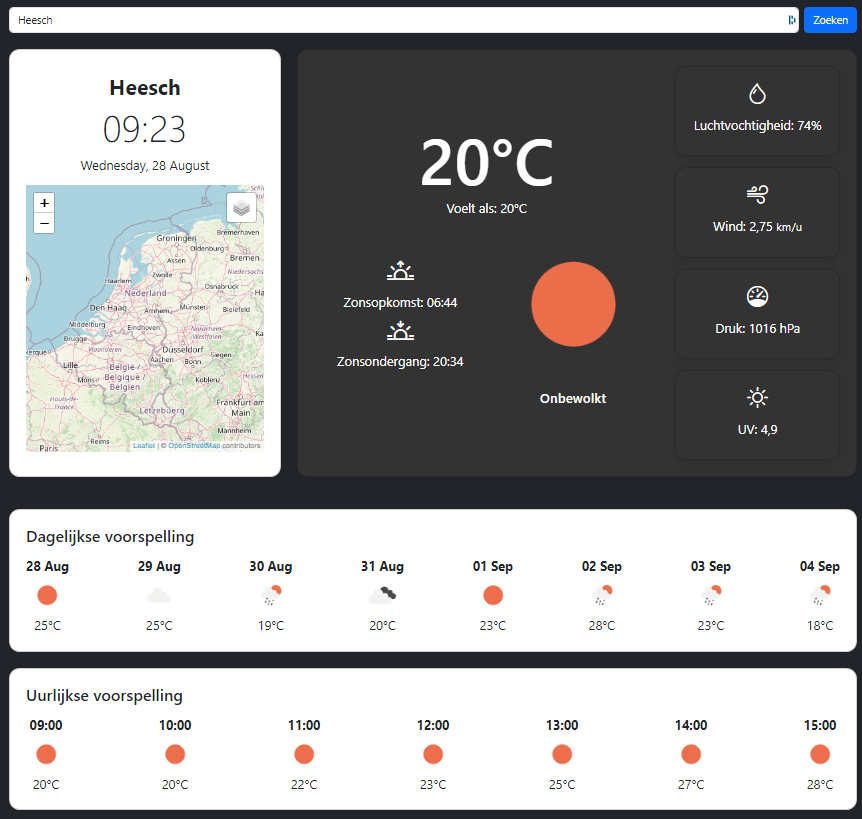

# Weather Dashboard

A Django-based weather dashboard that provides real-time weather data, including temperature, UV index, hourly forecasts, and weather alerts. This project utilizes the OpenWeatherMap API to fetch and display weather data.

 <!-- You can include a screenshot here if you like -->

## Features

- Real-time weather information for any city
- Hourly and 5-day weather forecasts
- Weather alerts displayed using Bootstrap alerts
- UV Index and other weather details
- Interactive map with weather overlays

## Requirements

- Python 3.x
- Django 5.x (or the version you're using)
- OpenWeatherMap API key

## Getting Started

Follow these steps to set up the project on your local machine.

### 1. Clone the Repository

```bash
git clone https://github.com/yourusername/weather-dashboard.git
cd weather-dashboard

2. Create and Activate a Virtual Environment
To keep your dependencies isolated, it's recommended to use a virtual environment.

On Linux/MacOS:
bash
Copy code
python3 -m venv venv
source venv/bin/activate
On Windows:
bash
Copy code
python -m venv venv
venv\Scripts\activate
3. Install the Dependencies
Install the necessary Python packages using pip.

bash
Copy code
pip install -r requirements.txt
4. Set Up the Environment Variables
Create a .env file in the root of the project directory and add your environment-specific variables:

env
Copy code
API_KEY=your_openweathermap_api_key
SECRET_KEY=your_django_secret_key
DEBUG=True
API_KEY: Your OpenWeatherMap API key. Sign up here if you don't have one.
SECRET_KEY: A secret key for Django. You can generate one using this Django Secret Key Generator.
DEBUG: Set this to True for development. Set it to False in production.
5. Apply Migrations
Run the following command to apply database migrations:

bash
Copy code
python manage.py migrate
6. Run the Development Server
Start the Django development server:

bash
Copy code
python manage.py runserver
Visit http://127.0.0.1:8000/ in your browser to see the weather dashboard in action.

Deployment
To deploy this project in a production environment, consider using services like Heroku, AWS, or DigitalOcean. Make sure to adjust the DEBUG setting to False and securely handle your environment variables.

Contributing
Contributions are welcome! Feel free to open issues or submit pull requests to improve the project.

License
This project is licensed under the MIT License. See the LICENSE file for more details.

Contact
For any inquiries, you can reach out via:

GitHub: @yourusername
Email: youremail@example.com
